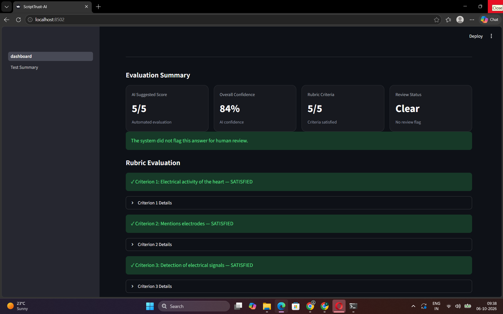
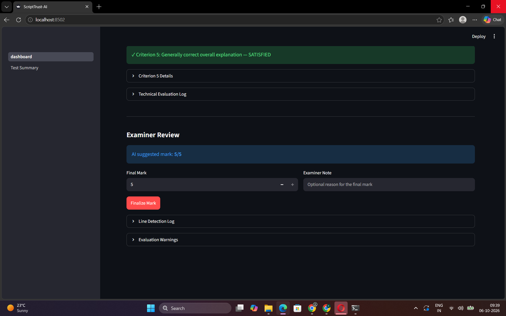

# ScriptTrust-AI

AI-powered handwritten exam evaluation system designed to assist examiners with
OCR-based answer transcription, rubric-driven scoring, semantic evaluation,
confidence estimation, and human review.

## Overview

ScriptTrust-AI processes a handwritten student answer and evaluates it against
a reference answer and marking rubric.

The system is designed around a **human-in-the-loop** workflow:

**Handwritten Answer → Line Detection → OCR → Semantic Evaluation → Rubric Scoring → Confidence → Human Review**

## Key Features

- Handwritten answer image upload
- Handwriting line detection
- OCR using Microsoft TrOCR
- Semantic similarity using Sentence Transformers
- Rubric-based criterion evaluation
- Criterion-level pass/fail decisions
- Evidence and feedback generation
- Confidence scoring
- Human-review recommendations
- Examiner mark override
- Test-summary validation dashboard
- Streamlit-based interface

## System Architecture

                ┌──────────────────────┐
                │ Handwritten Answer   │
                │       Image          │
                └──────────┬───────────┘
                           │
                           ▼
                ┌──────────────────────┐
                │    Line Detection    │
                └──────────┬───────────┘
                           │
                           ▼
                ┌──────────────────────┐
                │   TrOCR Handwriting  │
                │         OCR          │
                └──────────┬───────────┘
                           │
                           ▼
                ┌──────────────────────┐
                │ Semantic Evaluation  │
                │ Sentence Embeddings  │
                └──────────┬───────────┘
                           │
                           ▼
                ┌──────────────────────┐
                │ Rubric-based Scoring │
                └──────────┬───────────┘
                           │
                           ▼
                ┌──────────────────────┐
                │ Confidence + Review  │
                │      Decision        │
                └──────────┬───────────┘
                           │
                           ▼
                ┌──────────────────────┐
                │ Examiner Dashboard   │
                └──────────────────────┘

## Tech Stack

- Python
- PyTorch
- Hugging Face Transformers
- Microsoft TrOCR
- Sentence Transformers
- OpenCV
- Pillow
- NumPy
- Streamlit

## Project Structure

    ScriptTrust-AI/
    ├── app/
    │   ├── dashboard.py
    │   ├── test_dashboard.py
    │   └── pages/
    │       └── 2_Test_Summary.py
    ├── data/
    │   ├── questions/
    │   └── answers/
    ├── src/
    │   ├── diagnostic.py
    │   ├── evaluator.py
    │   ├── hybrid_evaluator.py
    │   ├── line_detector.py
    │   ├── ocr.py
    │   ├── ocr_lines.py
    │   ├── ocr_test.py
    │   ├── rubric_evaluator.py
    │   ├── semantic_evaluator.py
    │   └── test_dashboard.py
    ├── requirements.txt
    ├── README.md
    └── .gitignore

## Demo Screenshots

### Evaluation Summary

### Examiner Review

## Example Evaluation

Example question:

> Explain the working principle of an ECG.

The system evaluates the answer against five rubric criteria:

1. Electrical activity of the heart
2. Mention of electrodes
3. Detection of electrical signals
4. Recording/display as waveform
5. Overall correctness

The dashboard provides:

- AI suggested score
- Criterion-level results
- Semantic similarity
- Supporting evidence
- Confidence
- Human-review recommendation
- Examiner final-mark override

## Validation

The current test dataset contains **6 handwritten answer samples** with expected
scores ranging from 0/5 to 5/5.

| Answer | Expected | AI Score |
|--------|----------|----------|
| answer_01 | 5/5 | 5/5 |
| answer_02 | 4/5 | 4/5 |
| answer_03 | 2/5 | 2/5 |
| answer_04 | 3/5 | 3/5 |
| answer_05 | 1/5 | 1/5 |
| answer_06 | 0/5 | 0/5 |

Validation result: 6/6 exact score matches on the current test dataset.

> This validation is a small project-level test set and should not be interpreted
> as production accuracy.

## Human-in-the-Loop Design

ScriptTrust-AI is intended to **assist examiners rather than replace them**.

The system can recommend human review when confidence is low or an evaluation
appears ambiguous. The examiner can then accept or modify the suggested mark.

## Current Limitations

- TrOCR performs best when handwriting is segmented into individual lines.
- Handwriting quality and image quality can affect OCR performance.
- The current evaluation approach is a prototype and requires broader
  validation before high-stakes use.
- The current test dataset is small.

## Future Improvements

- Larger real-world handwritten-answer datasets
- Improved handwriting segmentation
- Better OCR error correction
- More advanced rubric reasoning
- Structured JSON evaluation output
- Examiner report generation
- Authentication and role-based access
- API deployment
- Production-scale evaluation and monitoring

## Purpose

ScriptTrust-AI explores how computer vision, OCR, NLP, semantic similarity,
and human review workflows can be combined to support automated assessment.

## Status

**Prototype / Portfolio Project**

Built as an end-to-end AI assessment prototype with a focus on explainability,
confidence estimation, and human oversight.
